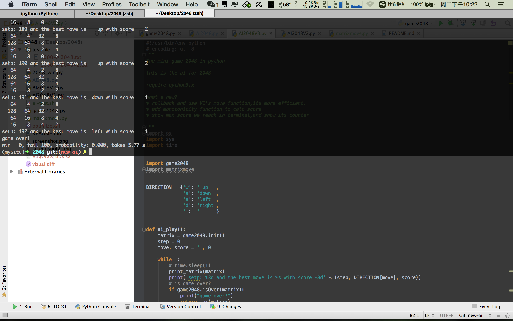

python-2048
===========

2048小游戏的python简单实现。

最近这款小游戏非常火，想想算法也挺简单，忍不住用python实现了一个，目前还很简陋。

暂时只有终端界面，以后考虑用一种GUI美化(wxpython,qt,kivy...还没选好)，或者flask,django的web框架，都简单

目前终端只支持按键回车操作，以后考虑直接终端捕获按键，无需按回车确认。

另外，规则也不完善，比如每次新插入的数字只有2，没有加入随机数4，以后加上。

目前已实现了无限撤消的功能。

Xander更新：目前视图已经改进  - 2015年 9月 4日 星期五 15时42分42秒 CST

文件说明
===

**python-2048.py**：在linux/mac下运行，支持无需回车确认操作，这个模块在windows下不能用。

**python-2048-win.py**：在windows下运行，每次指令需要回车确认。

ScreenShort
===

===
新添增了AI设计，为研究其输出文本格式为：
次数-版本号.txt

V1版本：
* 求能使空白快最多的移动方向，并使之移动

V2版本：
* 为每一行的移动增加了哈希表期望能够更快的进行移动运算，然而结果却比不上V1
* 封装了移动函数

v3版本：
* 移动函数回滚到V1版本
* 增加了矩阵单调性评估
* 优化了输出，显示在多次运行中所得最高分